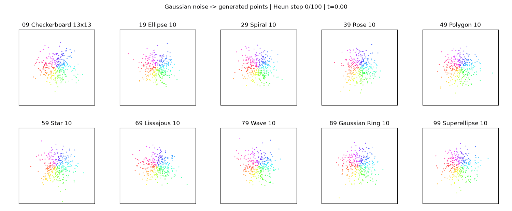

# RSI Flow Lab

A practical, agent-guided recursive self-improvement (RSI) workflow for model architecture research: use each experiment's measured failures to design, implement, and evaluate the next candidate.

**Result:** **21/100 → 100/100 passing classes across 19 recorded experiments.** The final model, `density_guided_mixture_mlp` with FFN width 144, has **308,674 parameters** and mean SW1 **0.02776**. All four acceptance checks pass for every class. The 100-class search is complete; scheduled iteration has stopped.

## The RSI workflow

**Measure → diagnose → propose → implement → train → evaluate → record → repeat.**

1. **Measure a baseline.** Generate 100 noisy 2D shape distributions and train a velocity model with flow matching.
2. **Diagnose concrete failures.** Inspect per-class precision, coverage, grid JS, and sliced Wasserstein distance. Use loss and animations as supporting evidence, rather than treating lower training loss as success.
3. **Propose a model change.** Target the observed weakness using architectural reasoning and, where relevant, research literature. Retain the best measured candidate when a new one regresses.
4. **Implement and verify.** Preserve the `(points, time, labels) → velocity` interface; check gradients, numerical formulas, checkpoint compatibility, and MPS execution as appropriate.
5. **Run a fixed experiment.** Train each candidate from scratch. Check long-running jobs hourly instead of continuously polling logs.
6. **Evaluate and preserve evidence.** Publish the configuration, metrics, per-class report, comparison image, and inference animation to GitHub after every completed round, including failures. Use that record to choose the next experiment.

The recursive step is the feedback from evaluation into the next architecture and code revision. An AI coding agent performs that outer research loop; PyTorch optimizes each candidate's weights in the inner training loop. The velocity model does not rewrite itself, and this repository does not implement a standalone autonomous RSI controller or demonstrate general-purpose intelligence improvement.

**Fixed contract.** Across the recorded benchmark runs: the same dataset definition, velocity-MSE objective, training settings, evaluation rules, and **100-step Heun** sampler. During the goal-driven search from EXP-009 onward, parameter count stays within **281,346 ±10%**. No target shape formulas are embedded in model initialization, and no evaluation thresholds are relaxed. Full outputs/checkpoints remain local under ignored `outputs/`; selected evidence is versioned under `experiments/`.

## How the method evolved

The successful direction was **better feature processing → learned local geometry → geometry-informed neural correction**. Not every step improved the result; the table below summarizes both the hypotheses and the evidence.

| Experiments | Direction and rationale | Observed result / decision |
|---|---|---|
| **001–006: backbone search** | Start with MLP; test Transformer, CNN, residual MLP, and feature-sequence U-Net. Build Global MLP with dense global mixing, normalization, residuals, and channel gates to test strong feature interaction without QKV. | MLP **21**, Transformer **36**, CNN **28**, residual MLP **24**, U-Net **14**, Global MLP **42**. The combined Global MLP design is effective; attention is not required for this pass count. |
| **007–008: conditioning** | Let class/time information control feature scales and shifts inside blocks. Removing the class token might lose useful interactions, so restore all three tokens while adding separate modulation paths. | Separate class conditioning: **39**. Three-token time/class modulation: **46**. Keep the latter. |
| **009–010: spatial frequencies** | Add more fixed Fourier frequencies, then learn class-specific directions/frequencies, to represent finer spatial variation. | **43** and **41**. Richer global frequency features do not solve the remaining local fitting failures. |
| **011–012: local Gaussian geometry** | Combine learned Gaussian-basis velocity with an MLP correction. Extend axis-aligned components to full covariance so local ellipses can align with slanted curves. | Diagonal hybrid **39**; correlated hybrid **50**. Local geometry is promising even though the first version regresses in total passes. |
| **013–014: correction and parameterization** | Test whether a pure Gaussian field is sufficient. Then return to the hybrid and learn ellipse angle and principal widths directly, with an anisotropic initialization. | Pure mixture **5**; principal-axis hybrid **61**. Keep the neural correction and the improved geometric parameterization. |
| **015–016: velocity guidance** | Feed the Gaussian branch's predicted velocity into the correction MLP, so it can use the prediction it is refining. Also test injecting that velocity into every block's modulation. | Input guidance **82**, block guidance **81**. Retain input guidance; more injection sites do not help this run. |
| **017: dispersion guidance** | Equal mean velocities can hide very different component predictions. Expose their weighted covariance so the MLP can distinguish agreement from opposing directions. | **93**. Between-component velocity dispersion adds useful information beyond the mean. |
| **018: density and entropy** | Add the model's local log density and responsibility entropy to describe probability concentration and component overlap. These are internally computed features, not extra supervision. | **98**. All grid-JS checks pass; only two precision failures remain. |
| **019: correction capacity** | Keep the effective geometry features and increase FFN width from 128 to 144, testing whether a little more correction capacity resolves the final failures. | **100**. The final candidate satisfies the fixed acceptance criteria within the parameter budget. |

## What the experiments taught us

- **Useful intermediate information mattered more than parameter growth in the largest later gains.** EXP-015, EXP-017, and EXP-018 add only 64, 96, and 64 parameters respectively. Their MLP receives progressively richer summaries of a learned local geometric model.
- **Geometry and neural correction work together.** The final architecture combines an analytic Gaussian-mixture velocity with a learned correction: `v = v_gaussian + t(1-t) * correction`. The correction uses position, time, class, mean velocity, between-component dispersion, density, and entropy. It still learns through the original velocity MSE and generates points through Heun integration.
- **Failures shaped the route.** Residuals alone were insufficient; extra Fourier frequencies did not help; the pure Gaussian model regressed sharply; block-level guidance did not beat input guidance. All remain in the experiment record.
- **Passing classes and average error are different objectives.** Many later failures were small precision shortfalls. Better local corrections can move classes across the fixed acceptance thresholds without proportionally improving mean SW1 or validation loss.
- **Mechanisms remain hypotheses, not isolated causal proofs.** These are single-seed experiments; some rounds change several architectural details. Changing width can also change initialization RNG consumption and subsequent training draws. Final sampling is independently re-seeded, but multi-seed and controlled ablations are needed to establish robustness. **100/100 means passing this finite-sample evaluation, not exact distribution equivalence.**



[Final configuration](experiments/019-density-wide144/config.json) · [All 100 class results](experiments/019-density-wide144/quality.csv) · [Acceptance report](experiments/019-density-wide144/quality_report.json) · [Target vs. generated](experiments/019-density-wide144/comparison.png)

## Experiments

| ID | Method / change | Dataset | Validation MSE ↓ | Mean SW1 ↓ | Classes passing ↑ | Finding |
|---|---|---|---:|---:|---:|---|
| [001](#exp-001--flow-matching-baseline) | Conditional MLP flow matching; baseline | `checkerboard_v2`, 100 classes | 1.0902 | 0.0340 | 21/100 | Global distributions improve, but most classes fail at least one fit check. |
| [002](#exp-002--transformer-backbone) | Three-token Transformer; same training settings | `checkerboard_v2`, 100 classes | 1.1243 | 0.0315 | 36/100 | More classes pass with similar parameter count, at higher runtime cost. |
| [003](#exp-003--cnn-backbone) | Three-position Conv1d; same training settings | `checkerboard_v2`, 100 classes | 1.1062 | 0.0322 | 28/100 | Fit improves over MLP, trails Transformer, with longer observed runtime than both. |
| [004](#exp-004--residual-mlp) | MLP with identity skips only; no LayerNorm | `checkerboard_v2`, 100 classes | 1.0889 | 0.0333 | 24/100 | Small improvement over MLP; residuals alone do not close the Transformer gap. |
| [005](#exp-005--unet-backbone) | Two-level feature-sequence U-Net | `checkerboard_v2`, 100 classes | 1.1305 | 0.0437 | 14/100 | Worse fit than baseline in this configuration. |
| [006](#exp-006--global-mlp) | Global dense mixing, norms, residuals and channel gates; no attention | `checkerboard_v2`, 100 classes | 1.1135 | 0.0317 | 42/100 | Higher pass count than Transformer; mean SW1 slightly above it. |
| [007](#exp-007--class-conditioned-mlp) | Separate class modulation; two main tokens | `checkerboard_v2`, 100 classes | 1.0864 | 0.0320 | 39/100 | 39 classes pass versus 42 for Global MLP; the small regression does not establish a general disadvantage of conditioning. |
| [008](#exp-008--modulated-global-mlp) | Three tokens plus zero-initialized time/class modulation | `checkerboard_v2`, 100 classes | 1.1132 | 0.0303 | 46/100 | 46 classes pass versus 42 for Global MLP, with mean SW1 improving to 0.03033; the best completed result at this stage, below the 60-class goal. |
| [009](#exp-009--extended-fixed-fourier-features) | Modulated MLP; 16 fixed coordinate frequencies | `checkerboard_v2`, 100 classes | 1.0631 | 0.0315 | 43/100 | 43 classes pass versus 46 for EXP-008. More fixed high-frequency features do not improve the acceptance count; retain EXP-008 as the best baseline. |
| [010](#exp-010--adaptive-fourier-features) | Modulated Global MLP + learned Fourier basis | `checkerboard_v2`, 100 classes | 1.0630 | 0.0314 | 41/100 | 41/100 passed, below the 46/100 best in EXP-008. Learned spatial directions did not improve the combined acceptance checks; retain EXP-008 as the best model. |
| [011](#exp-011--learned-gaussian-basis-with-mlp-correction) | Gaussian basis + modulated MLP | `checkerboard_v2`, 100 classes | 1.0928 | 0.0279 | 39/100 | 39/100 passed versus the best 46/100 in EXP-008, despite the lowest mean SW1 so far (0.02794). Some checkerboard and rose classes now pass, but spiral and wave performance regresses. Local density modeling is promising but does not yet improve overall acceptance. |
| [012](#exp-012--correlated-gaussian-basis) | Full-covariance Gaussian basis + MLP | `checkerboard_v2`, 100 classes | 1.0920 | 0.0278 | 50/100 | New best: 50/100 passed, up from 46/100 in EXP-008 and 39/100 in EXP-011. Mean SW1 also improves to 0.02782. Several remaining spiral, star and wave classes narrowly fail precision, motivating a density-consistent velocity model. |
| [013](#exp-013--density-consistent-gaussian-mixture) | Full-covariance Gaussian mixture | `checkerboard_v2`, 100 classes | 1.0935 | 0.0295 | 5/100 | Only 5/100 passed; removing the MLP correction severely regresses combined acceptance despite mean SW1 of 0.02950. Reject this candidate and retain the 50/100 hybrid from EXP-012. |
| [014](#exp-014--principal-axis-gaussian-hybrid) | Principal-axis Gaussian basis + MLP | `checkerboard_v2`, 100 classes | 1.0912 | 0.0278 | 61/100 | Goal reached: 61/100 passed, improving the previous best 50/100. Mean SW1 is 0.02780. All checkerboards pass and several thin-curve families improve, although waves remain unsuccessful. Parameter count is 8.2% above the 281346 reference; training, data, evaluation and 100-step Heun are unchanged. |
| [015](#exp-015--velocity-guided-gaussian-hybrid) | Gaussian velocity-guided MLP | `checkerboard_v2`, 100 classes | 1.0911 | 0.0281 | 82/100 | 80-class goal reached: 82/100 passed versus 61/100 in EXP-014. Thin-curve families improve substantially, while some Gaussian-ring and superellipse classes regress. Mean SW1 is slightly worse (0.02806 versus 0.02780); the improvement is in the fixed combined acceptance checks, not every metric. Parameter count remains within the original 281346 ±10% budget. |
| [016](#exp-016--block-level-velocity-guidance) | Velocity guidance in every block | `checkerboard_v2`, 100 classes | 1.0911 | 0.0280 | 81/100 | 81/100 passed versus 82/100 in EXP-015. Mean SW1 is nearly unchanged (0.02803). Block-level velocity conditioning does not improve this single-seed result; retain EXP-015 as the best model. |
| [017](#exp-017--velocity-dispersion-guidance) | Mean and dispersion-guided MLP | `checkerboard_v2`, 100 classes | 1.0898 | 0.0279 | 93/100 | New best: 93/100 passed, up from 82/100 in EXP-015. Five remaining classes fail precision and two fail grid JS. Mean SW1 is 0.02795. Local second-moment guidance substantially improves acceptance under unchanged training and evaluation. |
| [018](#exp-018--density-and-entropy-guidance) | Velocity moments + density and entropy | `checkerboard_v2`, 100 classes | 1.0894 | 0.0277 | 98/100 | New best: 98/100 passed versus 93/100 in EXP-017. Mean SW1 improves to 0.02774. Only Rose 04 (33) and Lissajous 02 (61) fail precision; every grid-JS check passes. The unchanged 100/100 goal remains open. |
| [019](#exp-019--wider-density-guided-hybrid) | Density-guided hybrid, FFN 144 | `checkerboard_v2`, 100 classes | 1.0761 | 0.0278 | 100/100 | 100/100 goal reached: every class passes all four unchanged checks. Mean SW1 is 0.02776 (slightly above EXP-018). Parameter count is 9.7% above the 281346 reference, within budget. This is a single-seed, finite-sample acceptance result, not proof of exact distribution equivalence. |

### Fit-check pass rate by shape family

Each cell shows **passing classes / 10 variants**. A class passes only when all four fit checks pass; these are class-level acceptance rates, not per-point accuracy.

| Class IDs | Shape family | MLP (001) | Transformer (002) | CNN (003) | Residual MLP (004) | U-Net (005) | Global MLP (006) | Class cond. (007) | Modulated (008) | Fourier16 (009) | Adaptive Fourier (010) | Gaussian basis (011) | Correlated basis (012) | Pure mixture (013) | Oriented basis (014) | Guided basis (015) | Block guidance (016) | Dispersion guidance (017) | Density guidance (018) | Density wide144 (019) |
|---|---|---:|---:|---:|---:|---:|---:|---:|---:|---:|---:|---:|---:|---:|---:|---:|---:|---:|---:|---:|
| 00–09 | Checkerboards | 0/10 | 0/10 | 0/10 | 0/10 | 0/10 | 0/10 | 0/10 | 0/10 | 0/10 | 0/10 | 4/10 | 7/10 | 3/10 | 10/10 | 10/10 | 10/10 | 10/10 | 10/10 | 10/10 |
| 10–19 | Ellipses | 9/10 | 10/10 | 10/10 | 10/10 | 8/10 | 10/10 | 10/10 | 10/10 | 10/10 | 10/10 | 9/10 | 10/10 | 0/10 | 10/10 | 10/10 | 10/10 | 10/10 | 10/10 | 10/10 |
| 20–29 | Spirals | 0/10 | 2/10 | 0/10 | 0/10 | 0/10 | 2/10 | 2/10 | 3/10 | 3/10 | 3/10 | 0/10 | 0/10 | 0/10 | 1/10 | 6/10 | 6/10 | 10/10 | 10/10 | 10/10 |
| 30–39 | Roses | 0/10 | 0/10 | 0/10 | 0/10 | 0/10 | 0/10 | 0/10 | 0/10 | 0/10 | 0/10 | 2/10 | 4/10 | 2/10 | 6/10 | 7/10 | 7/10 | 9/10 | 9/10 | 10/10 |
| 40–49 | Polygons | 1/10 | 6/10 | 3/10 | 3/10 | 1/10 | 8/10 | 5/10 | 10/10 | 6/10 | 7/10 | 7/10 | 10/10 | 0/10 | 10/10 | 10/10 | 10/10 | 10/10 | 10/10 | 10/10 |
| 50–59 | Stars | 0/10 | 0/10 | 0/10 | 0/10 | 0/10 | 0/10 | 1/10 | 1/10 | 2/10 | 0/10 | 0/10 | 0/10 | 0/10 | 2/10 | 7/10 | 6/10 | 8/10 | 10/10 | 10/10 |
| 60–69 | Lissajous curves | 0/10 | 0/10 | 0/10 | 0/10 | 0/10 | 0/10 | 0/10 | 0/10 | 0/10 | 0/10 | 0/10 | 0/10 | 0/10 | 3/10 | 8/10 | 8/10 | 9/10 | 9/10 | 10/10 |
| 70–79 | Waves | 0/10 | 1/10 | 1/10 | 0/10 | 0/10 | 3/10 | 3/10 | 4/10 | 3/10 | 3/10 | 0/10 | 0/10 | 0/10 | 0/10 | 8/10 | 8/10 | 9/10 | 10/10 | 10/10 |
| 80–89 | Gaussian rings | 2/10 | 8/10 | 5/10 | 1/10 | 0/10 | 9/10 | 8/10 | 9/10 | 9/10 | 9/10 | 7/10 | 9/10 | 0/10 | 9/10 | 7/10 | 7/10 | 8/10 | 10/10 | 10/10 |
| 90–99 | Superellipses | 9/10 | 9/10 | 9/10 | 10/10 | 5/10 | 10/10 | 10/10 | 9/10 | 10/10 | 9/10 | 10/10 | 10/10 | 0/10 | 10/10 | 9/10 | 9/10 | 10/10 | 10/10 | 10/10 |
| **Total** | **All families** | **21/100** | **36/100** | **28/100** | **24/100** | **14/100** | **42/100** | **39/100** | **46/100** | **43/100** | **41/100** | **39/100** | **50/100** | **5/100** | **61/100** | **82/100** | **81/100** | **93/100** | **98/100** | **100/100** |

### EXP-001 — Flow matching baseline

**Question.** Can a small conditional MLP fit 100 noisy 2D shape distributions?

**Method.** Generate target coordinates online from ten shape families: checkerboards, ellipses, spirals, roses, polygons, stars, Lissajous curves, waves, Gaussian rings, and superellipses. Each family has ten parameter variants. Add Gaussian coordinate noise with standard deviation 0.035.

Train on `x_t = (1 − t)x_0 + tx_1`, where `x_0 ~ N(0, I)` and `x_1` is a target point. The MLP takes `(x_t, t, label)` and predicts velocity, supervised by `MSE(v, x_1 − x_0)`. Generate point clouds by integrating the learned velocity with Heun's method.

| Setting | Value |
|---|---|
| Model | 4 hidden layers × 256 units, SiLU, class embeddings, spatial/time Fourier features |
| Training | 15,000 steps; batch 2,048; AdamW; LR 0.001; 500-step warmup + cosine decay |
| Sampling | 100 Heun steps; 2,000 points per class |
| Run | Seed 42; PyTorch 2.8.0; Apple MPS; 2026-09-30 |
| Duration | 425.5 s, including training progress sampling/plots; excluding final sampling/evaluation |

**Inference.** The same particles move from Gaussian noise to the generated distribution. Colors remain fixed. This animation shows classes 09, 19, …, 99, with 300 particles per class and 101 frames. Weights stay fixed throughout the animation.


**Result.** Validation MSE fell from **1.6325 to 1.0902**. Mean sliced Wasserstein-1 was **0.0340**, versus **0.2331** for Gaussian noise. Only **21/100 classes passed** the combined fit checks. This is a working baseline with substantial fitting errors, not a solved benchmark.

[Target vs. generated](experiments/001-baseline/comparison.png) · [Per-class results](experiments/001-baseline/quality.csv) · [Exact configuration](experiments/001-baseline/config.json) · [Metrics](experiments/001-baseline/metrics.json) · [Acceptance thresholds](experiments/001-baseline/quality_report.json)

### EXP-002 — Transformer backbone

**Question.** Does replacing the MLP with a similarly sized Transformer improve distribution fitting under the same training settings?

**Method.** Use four Transformer encoder blocks with 64-dimensional tokens, four attention heads, a 256-dimensional feed-forward network, SiLU, pre-LayerNorm, and no dropout. Each point has position, time, and class tokens; the position token predicts velocity. Parameter count: **205,954**, versus **214,850** for the MLP. This run used PyTorch attention; the optional handwritten attention implementation was added afterward.

**Configuration.** Same dataset, 15,000 updates, batch 2,048, AdamW, LR 0.001, 500-step warmup, cosine decay, seed 42, MPS device, and evaluation settings as EXP-001. Sampling remains 100 Heun steps and 2,000 points per class. Run date: 2026-09-30. Measured duration: **2,606.0 s (43.4 min)** including training progress sampling/plots, excluding final sampling/evaluation; approximately **6.1×** the baseline duration, not an isolated training-throughput measurement.


**Result.** Validation MSE fell from **1.9254 to 1.1243**. Mean SW1 improved from the MLP's **0.0340 to 0.0315** (about **7.4%** lower), and passing classes increased from **21 to 36/100**.

**Finding.** This configuration improves the combined fit-check pass count, but 64 classes still fail and runtime is substantially higher. Its higher validation MSE does not imply worse generated distributions; validation sets differ between architectures, and flow loss is not the final fit criterion. This single-seed comparison does not establish that Transformers are generally better.

[Target vs. generated](experiments/002-transformer/comparison.png) · [Per-class results](experiments/002-transformer/quality.csv) · [Exact configuration](experiments/002-transformer/config.json) · [Metrics](experiments/002-transformer/metrics.json) · [Acceptance thresholds](experiments/002-transformer/quality_report.json)

### EXP-003 — CNN backbone

**Question.** Can a similarly sized convolutional backbone improve fitting under the same training settings?

**Method.** Project the same Fourier position/time features and class embedding into a three-position sequence. Apply four Conv1d layers with 128 channels, kernel size 3, zero padding, and SiLU, then flatten and predict 2D velocity. Convolution operates within each point's feature sequence, never across batch points or a raster image. No dropout or batch normalization. Parameter count: **207,810**.

**Configuration.** Same training and sampling settings as EXP-001/002: 100 classes, 15,000 updates, batch 2,048, AdamW, LR 0.001, 500-step warmup, cosine decay, seed 42, MPS, 100 Heun steps, and 2,000 points per class. Launch with `--model cnn --cnn-channels 128 --num-layers 4`. Measured duration: **3,979.3 s (66.3 min)** including training progress sampling/plots, excluding final sampling/evaluation; **9.4×** MLP and **1.5×** Transformer. These are observed run durations, not isolated throughput measurements.


**Result.** Validation MSE fell from **1.6418 to 1.1062**. Mean SW1 was **0.0322**, compared with **0.0340** for MLP and **0.0315** for Transformer. **28/100 classes passed**, versus 21 for MLP and 36 for Transformer.

**Finding.** CNN falls between MLP and Transformer on both mean SW1 and passing classes, with a longer observed runtime than either. It does not outperform the Transformer on these fit metrics, and 72 classes still fail. Conclusions are limited to this configuration and single seed.

[Target vs. generated](experiments/003-cnn/comparison.png) · [Per-class results](experiments/003-cnn/quality.csv) · [Exact configuration](experiments/003-cnn/config.json) · [Metrics](experiments/003-cnn/metrics.json) · [Acceptance thresholds](experiments/003-cnn/quality_report.json)

### EXP-004 — Residual MLP

**Question.** How much of the fitting improvement can be obtained by adding residual connections alone to the baseline MLP?

**Method.** Keep the baseline's Fourier features, class embedding, four hidden layers of width 256, SiLU, and **214,850 parameters**. Add an identity skip around each of the three hidden-to-hidden Linear + SiLU pairs: `h = h + SiLU(Wh + b)`. Input projection and output readout remain unchanged. No LayerNorm, dropout, residual scaling, or new parameters. Initial parameter tensors and initialization RNG state were verified identical to the baseline implementation at seed 42.

**Configuration.** Same training, sampling, and evaluation settings as EXP-001: 15,000 updates, batch 2,048, AdamW, LR 0.001, 500-step warmup, cosine decay, seed 42, MPS, 100 Heun steps, and 2,000 points per class. Select `--model residual_mlp`. Measured duration: **544.4 s (9.1 min)** including training progress sampling/plots, excluding final sampling/evaluation; about **1.28×** the baseline's observed duration.


**Result.** Validation MSE fell from **1.6486 to 1.0889**. Mean SW1 was **0.0333**, about **2.1%** below the baseline's 0.0340. **24/100 classes passed**, compared with 21 for MLP, 28 for CNN, and 36 for Transformer.

**Finding.** Residual connections alone give a modest improvement in this run, but do not close the gap to Transformer. Improvements are not uniform across families (see the table above). This single-seed ablation does not isolate the benefits of LayerNorm or attention; neither was added here.

[Target vs. generated](experiments/004-residual-mlp/comparison.png) · [Per-class results](experiments/004-residual-mlp/quality.csv) · [Exact configuration](experiments/004-residual-mlp/config.json) · [Metrics](experiments/004-residual-mlp/metrics.json) · [Acceptance thresholds](experiments/004-residual-mlp/quality_report.json)

### EXP-005 — UNet backbone

**Question.** Does a convolutional encoder–decoder with multiscale skip connections improve the pointwise velocity model?

**Method.** A feature-sequence Conv1d U-Net with channels 32 → 64 → 128, downsampling lengths 3 → 2 → 1, nearest-neighbor upsampling, and concatenated encoder skips. Two-convolution SiLU blocks; no normalization or dropout. The three positions represent position/time/class features, not image pixels. The bottleneck has length 1. Parameter count: **220,866**.

**Configuration.** Same training, sampling and evaluation settings as EXP-001: 15,000 updates, batch 2,048, AdamW, LR 0.001, 500-step warmup, cosine decay, seed 42, MPS, 100 Heun steps, 2,000 points per class. Select `--model unet --unet-channels 32`; depth is fixed. Observed duration: **5,488.4 s (91.5 min)** including progress sampling/plots, excluding final sampling/evaluation.


**Result.** Validation MSE fell from **1.6507 to 1.1305**. Mean SW1 was **0.0437**, versus the baseline's 0.0340; **14/100 classes passed**, versus 21 for MLP and 28 for CNN.

**Finding.** This feature-sequence U-Net underperforms the baseline on both fit metrics. The result does not establish that spatial image U-Nets are unsuitable; this model compresses only three heterogeneous feature positions. The cause of the regression has not been isolated.

[Target vs. generated](experiments/005-unet/comparison.png) · [Per-class results](experiments/005-unet/quality.csv) · [Exact configuration](experiments/005-unet/config.json) · [Metrics](experiments/005-unet/metrics.json) · [Acceptance thresholds](experiments/005-unet/quality_report.json)

### EXP-006 — Global MLP

**Question.** Can global dense mixing plus the surrounding Transformer-like operators achieve strong fit without Q/K/V attention?

**Method.** Use three 64-dimensional feature vectors, four blocks with two pre-LayerNorm residual branches each, and a final LayerNorm and position-vector readout. The first branch flattens all three vectors and applies a dense mixer (192 → 32 → 384), splitting into values and channel-gate logits. Per-vector channel softmax, multiplied by 64, gates values elementwise. The second branch is a SiLU FFN (64 → 256 → 64). No pairwise attention matrix or attention-weighted token aggregation. Parameter count: **214,786**.

**Configuration.** Same training, sampling and evaluation settings as EXP-001. Select `--model global_mlp --hidden-dim 256 --num-layers 4 --global-mlp-dim 64 --global-mlp-bottleneck 32`. Observed duration: **1,475.2 s (24.6 min)** including progress sampling/plots, excluding final sampling/evaluation.


**Result.** Validation MSE fell from **1.8889 to 1.1135**. Mean SW1 was **0.0317**, below the baseline's 0.0340 but slightly above Transformer's 0.0315. **42/100 classes passed**, compared with 21 for MLP, 24 for residual MLP, and 36 for Transformer.

**Finding.** Among EXP-001 through EXP-006, this attention-free design has the highest combined-check pass count, while Transformer has the lowest mean SW1. It shows that Q/K/V attention is not required to reach this pass count in this setup. Normalization, gating, feature representation and block structure changed together, so their individual contributions remain unresolved; 58 classes still fail.

[Target vs. generated](experiments/006-global-mlp/comparison.png) · [Per-class results](experiments/006-global-mlp/quality.csv) · [Exact configuration](experiments/006-global-mlp/config.json) · [Metrics](experiments/006-global-mlp/metrics.json) · [Acceptance thresholds](experiments/006-global-mlp/quality_report.json)

### EXP-007 — Class-conditioned MLP

**Question.** Does injecting class features into every block improve Global MLP?

**Method.** Keep only position and time in the main state. Each block maps the separate class feature to scale and shift, shared by mixer and FFN pre-normalizations. Retain dense mixing, channel softmax gates and residual branches; no Q/K/V attention. Parameter count: **222,914**.

**Configuration.** Same dataset, training and evaluation settings as EXP-001: 15,000 updates, batch 2,048, AdamW, LR 0.001, 500-step warmup, cosine decay, seed 42, MPS, 100 Heun steps and 2,000 points per class. Observed duration: **1,634.7 s (27.2 min)**, including progress sampling/plots and excluding final sampling/evaluation.


**Result.** Validation MSE fell from **1.8548 to 1.0864**. Mean SW1: **0.03197**. **39/100 classes passed**.

**Finding.** 39 classes pass versus 42 for Global MLP; the small regression does not establish a general disadvantage of conditioning. This is a single-seed result; family counts are reported only in the table above.

[Target vs. generated](experiments/007-class-conditioned-mlp/comparison.png) · [Per-class results](experiments/007-class-conditioned-mlp/quality.csv) · [Exact configuration](experiments/007-class-conditioned-mlp/config.json) · [Metrics](experiments/007-class-conditioned-mlp/metrics.json) · [Acceptance thresholds](experiments/007-class-conditioned-mlp/quality_report.json)

### EXP-008 — Modulated Global MLP

**Question.** Can direct time/class modulation improve the best Global MLP without removing its class token?

**Method.** Retain three main feature vectors and the original Global MLP branches. Each block receives projected time plus class features and predicts independent scale/shift pairs for mixer and FFN. Zero-initialized modulation preserves the baseline initial output, weights and RNG consumption. No Q/K/V attention. The added parameters make this a larger-capacity comparison. Parameter count: **281,346**.

**Configuration.** Same dataset, training and evaluation settings as EXP-001: 15,000 updates, batch 2,048, AdamW, LR 0.001, 500-step warmup, cosine decay, seed 42, MPS, 100 Heun steps and 2,000 points per class. Observed duration: **2,753.8 s (45.9 min)**, including progress sampling/plots and excluding final sampling/evaluation.


**Result.** Validation MSE fell from **1.8889 to 1.1132**. Mean SW1: **0.03033**. **46/100 classes passed**.

**Finding.** 46 classes pass versus 42 for Global MLP, with mean SW1 improving to 0.03033; the best completed result at this stage, below the 60-class goal. This is a single-seed result; family counts are reported only in the table above.

[Target vs. generated](experiments/008-modulated-global-mlp/comparison.png) · [Per-class results](experiments/008-modulated-global-mlp/quality.csv) · [Exact configuration](experiments/008-modulated-global-mlp/config.json) · [Metrics](experiments/008-modulated-global-mlp/metrics.json) · [Acceptance thresholds](experiments/008-modulated-global-mlp/quality_report.json)

### EXP-009 — Extended fixed Fourier features

**Question.** Does increasing spatial feature bandwidth improve the 46-class model?

**Method.** Keep the EXP-008 backbone and change only the model spatial_frequencies from 6 to 16 (coordinate harmonics pi through 16*pi). The position projection grows accordingly; all training and sampling settings are unchanged. Reproduce with --model modulated_global_mlp --spatial-frequencies 16 --hidden-dim 256 --num-layers 4. Parameter count: **283,906**.

**Configuration.** Same dataset, training and evaluation settings as EXP-001: 15,000 updates, batch 2,048, AdamW, LR 0.001, 500-step warmup, cosine decay, seed 42, MPS, 100 Heun steps and 2,000 points per class. Observed duration: **2,113.1 s (35.2 min)**, including progress sampling/plots and excluding final sampling/evaluation.


**Result.** Validation MSE fell from **1.8645 to 1.0631**. Mean SW1: **0.03148**. **43/100 classes passed**.

**Finding.** 43 classes pass versus 46 for EXP-008. More fixed high-frequency features do not improve the acceptance count; retain EXP-008 as the best baseline. This is a single-seed result; family counts are reported only in the table above.

[Target vs. generated](experiments/009-fourier16/comparison.png) · [Per-class results](experiments/009-fourier16/quality.csv) · [Exact configuration](experiments/009-fourier16/config.json) · [Metrics](experiments/009-fourier16/metrics.json) · [Acceptance thresholds](experiments/009-fourier16/quality_report.json)

### EXP-010 — Adaptive Fourier features

**Question.** Can class-specific learned spatial directions improve complex shape fitting?

**Method.** Keep the modulated Global MLP backbone and replace axis-aligned spatial Fourier features with 32 learned plane waves per class. Every class starts with the same four directions and eight harmonics; no target formulas or samples enter model initialization. Parameter count: **290,306**.

**Configuration.** Same dataset, training and evaluation settings as EXP-001: 15,000 updates, batch 2,048, AdamW, LR 0.001, 500-step warmup, cosine decay, seed 42, MPS, 100 Heun steps and 2,000 points per class. Observed duration: **2,324.5 s (38.7 min)**, including progress sampling/plots and excluding final sampling/evaluation.


**Result.** Validation MSE fell from **1.8677 to 1.0630**. Mean SW1: **0.03138**. **41/100 classes passed**.

**Finding.** 41/100 passed, below the 46/100 best in EXP-008. Learned spatial directions did not improve the combined acceptance checks; retain EXP-008 as the best model. This is a single-seed result; family counts are reported only in the table above.

[Target vs. generated](experiments/010-adaptive-fourier/comparison.png) · [Per-class results](experiments/010-adaptive-fourier/quality.csv) · [Exact configuration](experiments/010-adaptive-fourier/config.json) · [Metrics](experiments/010-adaptive-fourier/metrics.json) · [Acceptance thresholds](experiments/010-adaptive-fourier/quality_report.json)

### EXP-011 — Learned Gaussian basis with MLP correction

**Question.** Can a learned local density basis improve detailed shape fitting?

**Method.** Learn 400 diagonal Gaussian components per class and their analytic Gaussian-source interpolation velocity. Add a compact modulated Global MLP correction weighted by t(1-t). All classes start from the same generic grid; centers, scales and logits learn through the unchanged velocity MSE. Sampling still integrates the velocity with Heun. Parameter count: **273,890**.

**Configuration.** Same dataset, training and evaluation settings as EXP-001: 15,000 updates, batch 2,048, AdamW, LR 0.001, 500-step warmup, cosine decay, seed 42, MPS, 100 Heun steps and 2,000 points per class. Observed duration: **3,669.1 s (61.2 min)**, including progress sampling/plots and excluding final sampling/evaluation.


**Result.** Validation MSE fell from **1.2639 to 1.0928**. Mean SW1: **0.02794**. **39/100 classes passed**.

**Finding.** 39/100 passed versus the best 46/100 in EXP-008, despite the lowest mean SW1 so far (0.02794). Some checkerboard and rose classes now pass, but spiral and wave performance regresses. Local density modeling is promising but does not yet improve overall acceptance. This is a single-seed result; family counts are reported only in the table above.

[Target vs. generated](experiments/011-mixture-mlp/comparison.png) · [Per-class results](experiments/011-mixture-mlp/quality.csv) · [Exact configuration](experiments/011-mixture-mlp/config.json) · [Metrics](experiments/011-mixture-mlp/metrics.json) · [Acceptance thresholds](experiments/011-mixture-mlp/quality_report.json)

### EXP-012 — Correlated Gaussian basis

**Question.** Can rotated local Gaussian components improve thin and curved shapes?

**Method.** Extend the learned Gaussian basis with a bounded correlation per component, allowing full positive-definite 2D covariance. Use 384 components per class plus the same compact modulated MLP correction. No target geometry is used; the velocity loss and Heun sampler are unchanged. Parameter count: **304,290**.

**Configuration.** Same dataset, training and evaluation settings as EXP-001: 15,000 updates, batch 2,048, AdamW, LR 0.001, 500-step warmup, cosine decay, seed 42, MPS, 100 Heun steps and 2,000 points per class. Observed duration: **5,374.4 s (89.6 min)**, including progress sampling/plots and excluding final sampling/evaluation.


**Result.** Validation MSE fell from **1.2641 to 1.0920**. Mean SW1: **0.02782**. **50/100 classes passed**.

**Finding.** New best: 50/100 passed, up from 46/100 in EXP-008 and 39/100 in EXP-011. Mean SW1 also improves to 0.02782. Several remaining spiral, star and wave classes narrowly fail precision, motivating a density-consistent velocity model. This is a single-seed result; family counts are reported only in the table above.

[Target vs. generated](experiments/012-correlated-mixture/comparison.png) · [Per-class results](experiments/012-correlated-mixture/quality.csv) · [Exact configuration](experiments/012-correlated-mixture/config.json) · [Metrics](experiments/012-correlated-mixture/metrics.json) · [Acceptance thresholds](experiments/012-correlated-mixture/quality_report.json)

### EXP-013 — Density-consistent Gaussian mixture

**Question.** Does removing the unconstrained MLP correction improve precision?

**Method.** Remove the MLP correction and allocate the entire budget to 512 learned full-covariance Gaussian components per class. Use the same velocity MSE and 100-step Heun integration, without direct mixture sampling. Parameter count: **307,200**.

**Configuration.** Same dataset, training and evaluation settings as EXP-001: 15,000 updates, batch 2,048, AdamW, LR 0.001, 500-step warmup, cosine decay, seed 42, MPS, 100 Heun steps and 2,000 points per class. Observed duration: **5,029.4 s (83.8 min)**, including progress sampling/plots and excluding final sampling/evaluation.


**Result.** Validation MSE fell from **1.2553 to 1.0935**. Mean SW1: **0.02950**. **5/100 classes passed**.

**Finding.** Only 5/100 passed; removing the MLP correction severely regresses combined acceptance despite mean SW1 of 0.02950. Reject this candidate and retain the 50/100 hybrid from EXP-012. This is a single-seed result; family counts are reported only in the table above.

[Target vs. generated](experiments/013-gaussian-mixture/comparison.png) · [Per-class results](experiments/013-gaussian-mixture/quality.csv) · [Exact configuration](experiments/013-gaussian-mixture/config.json) · [Metrics](experiments/013-gaussian-mixture/metrics.json) · [Acceptance thresholds](experiments/013-gaussian-mixture/quality_report.json)

### EXP-014 — Principal-axis Gaussian hybrid

**Question.** Can principal-axis covariance learning improve thin local supports?

**Method.** Return to the EXP-012 hybrid with 384 components per class. Parameterize each covariance by a learned rotation angle and two positive principal widths instead of bounded correlation. Initialize all classes identically using a generic grid, eight orientations and widths 0.12/0.06; retain the compact modulated MLP correction. No shape formulas or target samples enter initialization. Parameter count: **304,290**.

**Configuration.** Same dataset, training and evaluation settings as EXP-001: 15,000 updates, batch 2,048, AdamW, LR 0.001, 500-step warmup, cosine decay, seed 42, MPS, 100 Heun steps and 2,000 points per class. Observed duration: **5,114.2 s (85.2 min)**, including progress sampling/plots and excluding final sampling/evaluation.


**Result.** Validation MSE fell from **1.2631 to 1.0912**. Mean SW1: **0.02780**. **61/100 classes passed**.

**Finding.** Goal reached: 61/100 passed, improving the previous best 50/100. Mean SW1 is 0.02780. All checkerboards pass and several thin-curve families improve, although waves remain unsuccessful. Parameter count is 8.2% above the 281346 reference; training, data, evaluation and 100-step Heun are unchanged. This is a single-seed result; family counts are reported only in the table above.

[Target vs. generated](experiments/014-oriented-mixture/comparison.png) · [Per-class results](experiments/014-oriented-mixture/quality.csv) · [Exact configuration](experiments/014-oriented-mixture/config.json) · [Metrics](experiments/014-oriented-mixture/metrics.json) · [Acceptance thresholds](experiments/014-oriented-mixture/quality_report.json)

### EXP-015 — Velocity-guided Gaussian hybrid

**Question.** Can the correction MLP use local geometry predicted by the Gaussian branch?

**Method.** Start from EXP-014 and add a zero-initialized 2-to-32 projection of the Gaussian branch velocity to the position token. This exposes local geometry to the correction MLP, adds only 64 parameters and preserves the baseline initial function and RNG stream. Both branches learn jointly through the original velocity MSE; external inputs, outputs and Heun sampling are unchanged. Parameter count: **304,354**.

**Configuration.** Same dataset, training and evaluation settings as EXP-001: 15,000 updates, batch 2,048, AdamW, LR 0.001, 500-step warmup, cosine decay, seed 42, MPS, 100 Heun steps and 2,000 points per class. Observed duration: **4,035.0 s (67.2 min)**, including progress sampling/plots and excluding final sampling/evaluation.


**Result.** Validation MSE fell from **1.2631 to 1.0911**. Mean SW1: **0.02806**. **82/100 classes passed**.

**Finding.** 80-class goal reached: 82/100 passed versus 61/100 in EXP-014. Thin-curve families improve substantially, while some Gaussian-ring and superellipse classes regress. Mean SW1 is slightly worse (0.02806 versus 0.02780); the improvement is in the fixed combined acceptance checks, not every metric. Parameter count remains within the original 281346 ±10% budget. This is a single-seed result; family counts are reported only in the table above.

[Target vs. generated](experiments/015-guided-mixture/comparison.png) · [Per-class results](experiments/015-guided-mixture/quality.csv) · [Exact configuration](experiments/015-guided-mixture/config.json) · [Metrics](experiments/015-guided-mixture/metrics.json) · [Acceptance thresholds](experiments/015-guided-mixture/quality_report.json)

### EXP-016 — Block-level velocity guidance

**Question.** Does injecting Gaussian velocity into residual-block modulation improve the input-guided model?

**Method.** Extend EXP-015 with a zero-initialized 2-to-32 projection of the Gaussian velocity into the shared time/class modulation condition. It adds 64 parameters while preserving the initial function and RNG stream. Parameter count: **304,418**.

**Configuration.** Same dataset, training and evaluation settings as EXP-001: 15,000 updates, batch 2,048, AdamW, LR 0.001, 500-step warmup, cosine decay, seed 42, MPS, 100 Heun steps and 2,000 points per class. Observed duration: **3,926.6 s (65.4 min)**, including progress sampling/plots and excluding final sampling/evaluation.


**Result.** Validation MSE fell from **1.2631 to 1.0911**. Mean SW1: **0.02803**. **81/100 classes passed**.

**Finding.** 81/100 passed versus 82/100 in EXP-015. Mean SW1 is nearly unchanged (0.02803). Block-level velocity conditioning does not improve this single-seed result; retain EXP-015 as the best model. This is a single-seed result; family counts are reported only in the table above.

[Target vs. generated](experiments/016-block-guided-mixture/comparison.png) · [Per-class results](experiments/016-block-guided-mixture/quality.csv) · [Exact configuration](experiments/016-block-guided-mixture/config.json) · [Metrics](experiments/016-block-guided-mixture/metrics.json) · [Acceptance thresholds](experiments/016-block-guided-mixture/quality_report.json)

### EXP-017 — Velocity dispersion guidance

**Question.** Can between-component velocity dispersion resolve remaining precision failures?

**Method.** Extend EXP-015 with three features describing the weighted covariance of component conditional velocity means. Project log-transformed diagonal variances and normalized cross-covariance into the position token. The zero-initialized projection adds 96 parameters and preserves the initial function and RNG stream. These features describe between-component dispersion, not total posterior uncertainty. Parameter count: **304,450**.

**Configuration.** Same dataset, training and evaluation settings as EXP-001: 15,000 updates, batch 2,048, AdamW, LR 0.001, 500-step warmup, cosine decay, seed 42, MPS, 100 Heun steps and 2,000 points per class. Observed duration: **5,345.3 s (89.1 min)**, including progress sampling/plots and excluding final sampling/evaluation.


**Result.** Validation MSE fell from **1.2631 to 1.0898**. Mean SW1: **0.02795**. **93/100 classes passed**.

**Finding.** New best: 93/100 passed, up from 82/100 in EXP-015. Five remaining classes fail precision and two fail grid JS. Mean SW1 is 0.02795. Local second-moment guidance substantially improves acceptance under unchanged training and evaluation. This is a single-seed result; family counts are reported only in the table above.

[Target vs. generated](experiments/017-dispersion-guided-mixture/comparison.png) · [Per-class results](experiments/017-dispersion-guided-mixture/quality.csv) · [Exact configuration](experiments/017-dispersion-guided-mixture/config.json) · [Metrics](experiments/017-dispersion-guided-mixture/metrics.json) · [Acceptance thresholds](experiments/017-dispersion-guided-mixture/quality_report.json)

### EXP-018 — Density and entropy guidance

**Question.** Can density magnitude and component overlap resolve the remaining failures?

**Method.** Extend EXP-017 with the model mixture log density (asinh transformed) and normalized responsibility entropy. A zero-initialized 2-to-32 projection injects them into the position token, adding 64 parameters while preserving the initial function and RNG stream. All features are computed from the learned model at the current point, without extra supervision. Parameter count: **304,514**.

**Configuration.** Same dataset, training and evaluation settings as EXP-001: 15,000 updates, batch 2,048, AdamW, LR 0.001, 500-step warmup, cosine decay, seed 42, MPS, 100 Heun steps and 2,000 points per class. Observed duration: **4,935.6 s (82.3 min)**, including progress sampling/plots and excluding final sampling/evaluation.


**Result.** Validation MSE fell from **1.2631 to 1.0894**. Mean SW1: **0.02774**. **98/100 classes passed**.

**Finding.** New best: 98/100 passed versus 93/100 in EXP-017. Mean SW1 improves to 0.02774. Only Rose 04 (33) and Lissajous 02 (61) fail precision; every grid-JS check passes. The unchanged 100/100 goal remains open. This is a single-seed result; family counts are reported only in the table above.

[Target vs. generated](experiments/018-density-guided-mixture/comparison.png) · [Per-class results](experiments/018-density-guided-mixture/quality.csv) · [Exact configuration](experiments/018-density-guided-mixture/config.json) · [Metrics](experiments/018-density-guided-mixture/metrics.json) · [Acceptance thresholds](experiments/018-density-guided-mixture/quality_report.json)

### EXP-019 — Wider density-guided hybrid

**Question.** Can a modestly wider correction MLP resolve the final two precision failures?

**Method.** Keep EXP-018 Gaussian geometry, mean/dispersion/density/entropy guidance and four-block structure. Increase only the MLP feed-forward hidden width from 128 to 144. All training, data, external input/output and evaluation settings remain fixed. Changing width changes initialization RNG consumption, so validation draws are not paired with EXP-018; final evaluation sampling uses the same reset seed. Parameter count: **308,674**.

**Configuration.** Same dataset, training and evaluation settings as EXP-001: 15,000 updates, batch 2,048, AdamW, LR 0.001, 500-step warmup, cosine decay, seed 42, MPS, 100 Heun steps and 2,000 points per class. Observed duration: **4,627.7 s (77.1 min)**, including progress sampling/plots and excluding final sampling/evaluation.


**Result.** Validation MSE fell from **1.2511 to 1.0761**. Mean SW1: **0.02776**. **100/100 classes passed**.

**Finding.** 100/100 goal reached: every class passes all four unchanged checks. Mean SW1 is 0.02776 (slightly above EXP-018). Parameter count is 9.7% above the 281346 reference, within budget. This is a single-seed, finite-sample acceptance result, not proof of exact distribution equivalence. This is a single-seed result; family counts are reported only in the table above.

[Target vs. generated](experiments/019-density-wide144/comparison.png) · [Per-class results](experiments/019-density-wide144/quality.csv) · [Exact configuration](experiments/019-density-wide144/config.json) · [Metrics](experiments/019-density-wide144/metrics.json) · [Acceptance thresholds](experiments/019-density-wide144/quality_report.json)

## Evaluation protocol

Each class must pass **all four checks**: sliced Wasserstein-1 (global distribution), nearest-distance precision (proximity to target support), coverage (missing regions), and multiscale grid JS divergence (local density). Thresholds are calibrated against independent target samples: at most 1,000 points per class, five calibration draws, distance tolerance ×1.5, and probability slack 0.05. These are heuristic acceptance checks, not proof of distributional equivalence.

Keep the dataset version, evaluation settings, sampling budget, and seeds fixed when comparing experiments. Report method changes and compute budgets explicitly. Durations are observed wall-clock times on a shared Mac, including progress sampling; concurrent workloads were not controlled, so these are not isolated speed benchmarks. These are single-seed results. Transformer, CNN, U-Net and Global MLP initialization consume different random draws from MLP, so their training streams and validation sets differ; those validation MSE comparisons are not paired. The residual MLP preserves the baseline initialization and RNG consumption, enabling a more controlled residual-only comparison. Final sampling is re-seeded independently of training.

## Reproduce

Use a Python environment with [requirements.txt](requirements.txt) installed. Run from the repository root:

```bash
python run_train.py --model mlp --device mps --num-classes 100 \
  --hidden-dim 256 --num-layers 4 --batch-size 2048 \
  --steps 15000 --warmup-steps 500 --learning-rate 0.001 --seed 42 \
  --sample-points 2000 --sample-steps 100 \
  --output-dir outputs/exp001_reproduction \
  --save-progress --save-every 1000 --log-every 500 \
  --inference-animation --animation-points 300 --inference-gif-duration-ms 50

python run_evaluate.py --output-dir outputs/exp001_reproduction
```

Use `--device cpu` or `--device cuda` on other hardware. Full checkpoints and generated files stay in the ignored `outputs/` directory. Selected results under `experiments/` are kept for GitHub. `progress.gif` shows training evolution; `inference.gif` shows particle movement through one fixed model.

## Swap models

`--model modulated_global_mlp` extends the best pass-count baseline (EXP-006)
without removing any of its three main feature vectors. Each block receives
`time_features + class_features` and predicts separate scale/shift pairs for
the mixer and FFN pre-normalizations. The modulation output is zero-initialized;
base modules are reused with identical initial weights and initialization RNG
state at the same seed. This is a fresh training run, not checkpoint fine-tuning.
It has 281,346 parameters with four blocks, feature width 64, bottleneck 32 and
FFN width 256, versus 214,786 for Global MLP. An equal-capacity baseline would be
needed to separate conditioning benefits from parameter-count effects.
Training settings and 100-step Heun sampling are unchanged; see EXP-008.

`--model class_conditioned_mlp` keeps only position and time in the main
feature sequence and calls `block(features, class_features)` at every layer.
Each block maps the separate class vector to a scale and shift, applied as
`LayerNorm(features) * (1 + scale) + shift` before both the global mixer and
FFN. This is FiLM-style conditioning inspired by a separate cross-conditioning
path, not Q/K/V cross-attention. Global dense mixing, channel softmax gates,
SiLU, two residual branches and final normalization remain. With width 64,
mixer bottleneck 32, FFN width 256 and four blocks it has 222,914 parameters
(versus Global MLP's 214,786). The experiment retains 100 Heun steps and all
baseline training settings; see EXP-007.

`--model global_mlp` provides an attention-free combined-operator experiment.
It uses the Transformer's three feature types and position-token readout, four
blocks with two pre-LayerNorm residual branches each, and a final LayerNorm.
Each first branch flattens all three vectors, applies a global dense MLP
(192 → 32 → 384), and splits its output into values and channel-gate logits.
Per-token channel softmax, scaled by channel count, gates values elementwise.
There are no Q/K/V projections, pairwise attention matrices, or weighted token
aggregation. The second branch is a shared SiLU FFN (64 → 256 → 64).
With `--hidden-dim 256 --num-layers 4`, the model has 214,786 parameters.
`--global-mlp-dim` defaults to 64 and `--global-mlp-bottleneck` to 32.
This tests the combined design, not the isolated effect of any one operator;
see EXP-006 for results.

The U-Net trial is available as `--model unet --unet-channels 32`. It applies
Conv1d to each point's position/time/class feature sequence, with two downsampling
levels (lengths 3 → 2 → 1), channels 32 → 64 → 128, and a decoder returning to
length 3 via nearest-neighbor resizing and concatenated encoder skips. It uses
SiLU without normalization or dropout. This is a feature-sequence U-Net, not a
raster-image U-Net; the bottleneck has length 1. Depth is fixed for this trial,
so `--num-layers` and `--hidden-dim` are unused. Use the baseline training command
with `--model unet` and a new output directory. See EXP-005 for results.

Available backbones: `--model mlp`, `--model transformer`, `--model cnn`, `--model residual_mlp`, `--model unet`, and `--model global_mlp`.
The residual-only ablation is available as `--model residual_mlp`: it keeps the
MLP's features, parameter layout, initialization, depth and width, adding identity skips
around the three hidden-to-hidden Linear + SiLU pairs (`h = h + SiLU(Wh + b)`).
The input projection and output readout are unchanged. No LayerNorm is added.
With four hidden layers of width 256 it has exactly 214,850 parameters, matching
EXP-001. Use the same reproduction command with a new output directory and
`--model residual_mlp`; see EXP-004 for results.

The CNN uses four width-three, zero-padded Conv1d layers with SiLU over a
three-position sequence of position/time/class features. It never convolves
across batch points. `--cnn-channels` defaults to 128; `--num-layers` sets its
depth, and `--hidden-dim` is unused by CNN. Its default four-layer configuration
has 207,810 parameters for 100 classes. Training and sampling settings can stay
identical to the other experiments; see EXP-003 for results.

Change only `--model mlp` to `--model transformer` or `--model cnn` in the training command above, and choose a new output directory. Optimizer, data, loss, evaluation and Heun sampling are shared. The checkpoint stores the architecture, so `run_sample.py --checkpoint ...` selects the matching model automatically; old MLP checkpoints remain supported.

The Transformer uses three tokens **within each point**: Fourier position features, Fourier time features, and a class embedding. Four encoder blocks attend over these tokens; the position token predicts the 2D velocity. Points in a batch never attend to one another. Defaults: token width 64 (`--transformer-dim`), four heads (`--num-heads`), no dropout. `--hidden-dim` controls MLP hidden width or Transformer feed-forward width; `--num-layers` controls backbone depth. With the experiment settings, MLP has 214,850 parameters and Transformer has 205,954.

To add a model, implement `__init__(ModelConfig)` and `forward(points[B,2], time[B,1], labels[B]) -> velocity[B,2]`, then add its class to `MODEL_REGISTRY` in [model/registry.py](model/registry.py). No changes to the trainer or sampler are needed.

## Add an experiment

Append one table row and one short entry: **question → method/change → configuration → results → inference GIF → finding**. Save selected artifacts in `experiments/020-<name>/` with the exact config and evaluation report. Retain failures and keep acceptance thresholds unchanged across comparisons.
